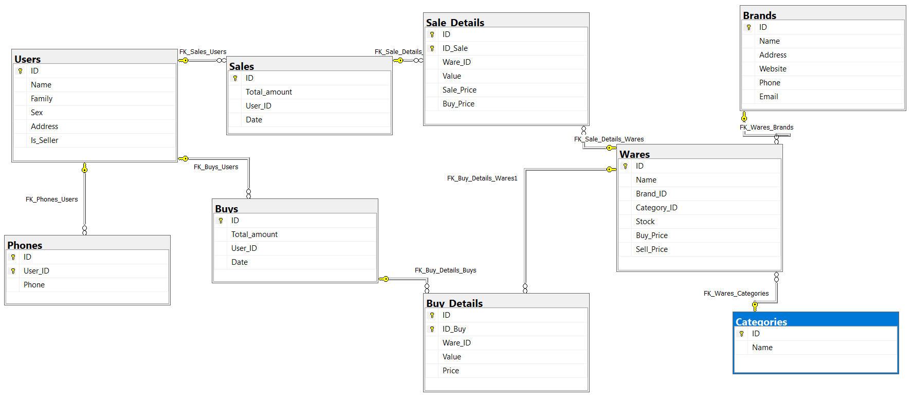
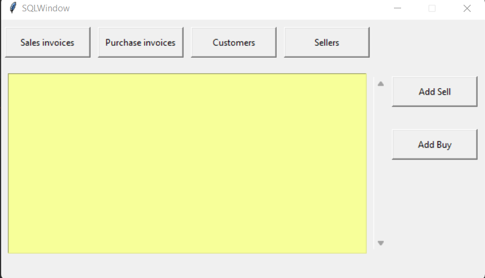
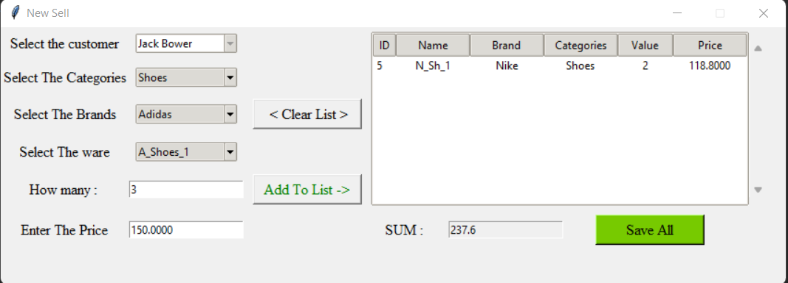

#  USE SQL SERVER FILES IN PYTHON
## Hello and Wellcome
### In This Project We Try to use some SQL structure in python
## For Example:
+ Connecting to sql server
+ Using sql server databases
+ Reading table's data
+ using Stored Procedure
+ Reading data by views in sql
+ Storing data in sql tables
+ Using sql commands
+ And finaly We try to create one Graphical User Interface by tkinter
###  <  Note: This a very simple project to familiarize you more with this environment >
## OK, Let's go

### At First we create a database by this tables:
+ Users
+ Phones
+ Sales
+ Buys
+ Sale_details
+ Buy_details
+ Wares
+ Brands
+ Caegories

And we connect theme to each Other by foreign key as you see

<br/>

and Now We Create To example views to use later
## We create Some StoredProcedure
the important note in here is :<br/>
in USP_BUY_DETAILS (Stored Procedure) after we call it, The function itself updates the buy price in the (Wares Table) bye calculating average price, then updates sell price With a twenty percent increase in the average purchase price
if you see the codes you can understand all of them and If you have any questions so i am here

## After creating the DataBase , we made a simple Graphical User Interface (GUI) by tkinter
You can take a look at it :

<br/>



## In order to cover almost many cases, we used a different object and different type of functions in sql_commands in each part
## All comboboxes and other objects take items directly from the functions written in part sql_commands
<br/>
Let's take a look at some of them:

```python
import pyodbc

DRV = '{SQL Server}'
SRV = '(local)'
DB = 'Test_Sale_DB'

# ======= Get All Customers by A view Called V_Customers =======================
def view_customers():
    conn = pyodbc.connect('DRIVER={};Server={};Database={}; Trusted_Connection=yes;'.format(DRV, SRV, DB))
    cursor = conn.cursor()
    cursor.execute("SELECT * FROM V_Customers")  # V_Customers is A view
    rows = cursor.fetchall()
    conn.close()
    return rows
```

```python
# ======== Get All items From Sells Table And join With Users To Find Out Customers Name ============
def view_sells():
    conn = pyodbc.connect('DRIVER={};Server={};Database={}; Trusted_Connection=yes;'.format(DRV, SRV, DB))
    cursor = conn.cursor()
    query = "SELECT S.ID,S.Total_amount,U.Name + ' ' + U.Family As FullName ,S.Date FROM" \
            " Sales S INNER JOIN Users U ON S.User_ID = U.ID"
    cursor.execute(query)
    rows = cursor.fetchall()
    conn.close()
    return rows
```

## Here is an interesting point : we made a function To Execute Any Stored Procedure Easily Just by calling its name and giving values of arguments
lets see it
```python
def exec_query(sp_name, **kwargs):
    params = ''
    for key, value in kwargs.items():
        if type(value) is str:
            params += "@" + key + "='" + value + "', "
        else:
            params += "@" + key + "=" + str(value) + ", "

    params = params[:-2]  # Delete Last --> ", "
    conn = pyodbc.connect('DRIVER={};Server={};Database={}; Trusted_Connection=yes;'.format(DRV, SRV, DB))
    cursor = conn.cursor()
    query = "EXEC {} {} ".format(sp_name, params)
    next_cursor = cursor.execute(query)
    rows = []
    while next_cursor:  # To Get OUTPUT if stored procedures had any output
        try:
            row_c = cursor.fetchone()
            while row_c:
                rows.append(row_c)
                row_c = cursor.fetchone()
        except pyodbc.ProgrammingError:
            next_cursor = cursor.nextset()
            continue
        next_cursor = cursor.nextset()

    cursor.commit()
    conn.close()
    return rows
```

## Let's see an example to use the above function:
```python
def add_buy_details(id_buy, ware_id, value, price):
    exec_query('USP_ADD_BUY_DETAILS', ID_Buy=id_buy, Ware_ID=ware_id, Value=value, Price=price)
```

so easily :)

Thank you for reading this section<br/>
My name is [Masoud Khosravi]() and I am here if you have any questions.